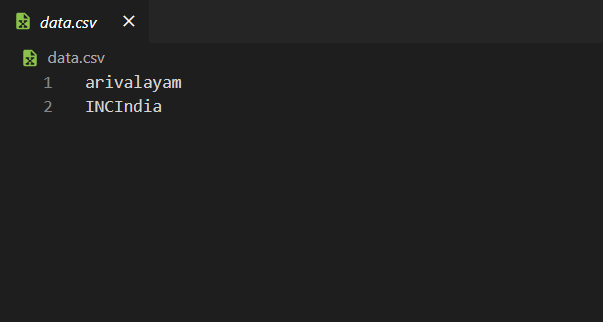

# Bot Blocker

Python based twitter account blocker

### Getting Started

Generate the following keys from [Twitter Developer Portal](https://developer.twitter.com/) and replace them in the config file (application.ini):

- consumer_key
- consumer_secret
- access_token
- access_secret

### How do I run the code?

```sh
python index.py -s twitter_handle # without '@'
python index.py --screen_name=twitter_handle # without '@'
```

### Sample data for blocking users via CSV



### Dependencies

- [Tweepy](https://github.com/tweepy/tweepy)
